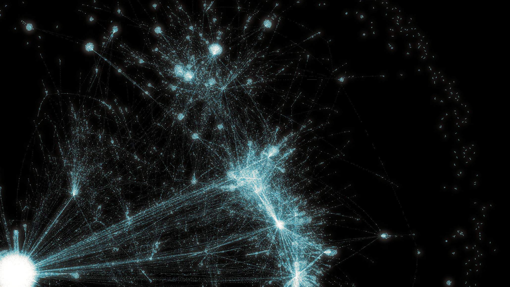

# EthGraph
EthGraph is a tool to generate GraphML for token movements for ERC20, ERC721 and ERC1155 (or their equivalents) on any EVM-compatible blockchain. [GraphML](https://en.wikipedia.org/wiki/GraphML) is an XML file format for graph data which is commonly used by graphing tools. We can then use those graphing tools to analyse token movements.

## How can this be used?
The token movements form a `graph` made up of `nodes` (addresses and movements) and `edges` (links between addresses and movement). A `movement` is a transfer of a single token type or single NFT between one address and another. ERC1155 transactions, which can move many NFTs in a single transaction, are decomposed into their individual movements.

When a GraphML file of token movements is opened in a graphing tool like [Gephi](https://gephi.org/) (free, open-source and cross-platform) we can easily visualise the token movements:

")

When zoomed out, patterns are repeated.



## How to install

### 1. Install Go
Official instructions [here](https://go.dev/doc/install), or for Ubuntu:
```
$ sudo apt update && sudo apt upgrade
$ sudo apt install golang-go
```
To check it installed ok:
```
$ go version
go version go1.18.1 linux/amd64
```
### 2. Install EthGraph
Download and build:
```
$ git clone https://github.com/KevinSmall/ethgraph.git 
$ cd ethgraph
$ go build .
```
To check it built ok, execute this to see version information:
```
$ ./ethgraph -v
ethgraph version 1.0.0
```

## How to use
Sample usage, here selecting block numbers from Ethereum mainnet:
```
$ ./ethgraph byblock "https://<RPC endpoint>"  -f 16_835_977 -t 16_835_978
```
If you were using Infura it might be:
```
$ ./ethgraph byblock  "https://mainnet.infura.io/v3/<your API key>>"  -f 16_835_977 -t 16_835_986
```
Or for Avalanche on Infura:
```
$ ./ethgraph byblock "https://avalanche-mainnet.infura.io/v3/<your API key>" -f 27_486_035 -t 27_486_094
```

The file created is called `<chainname>.graphml`. This can then be opened in Gephi or other graph tools, see [Wiki](https://github.com/KevinSmall/ethgraph/wiki) for more detailed usage.